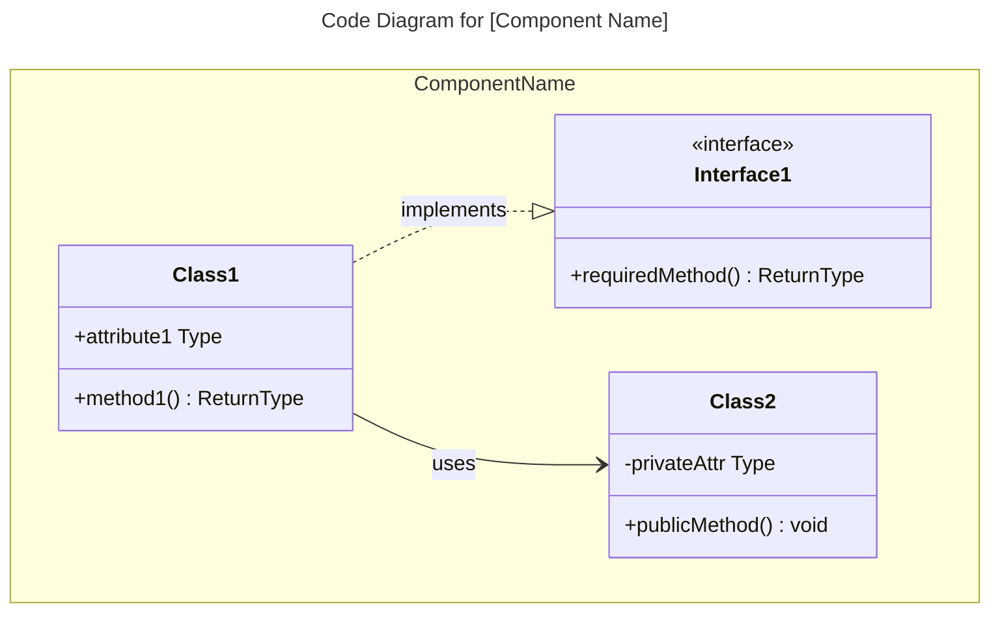
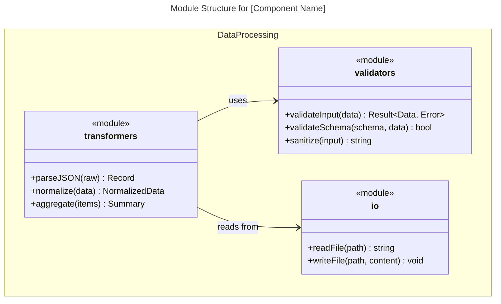
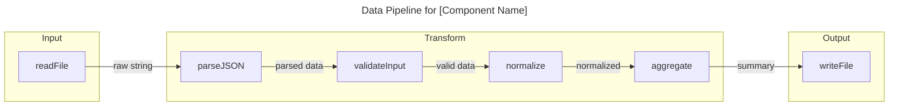
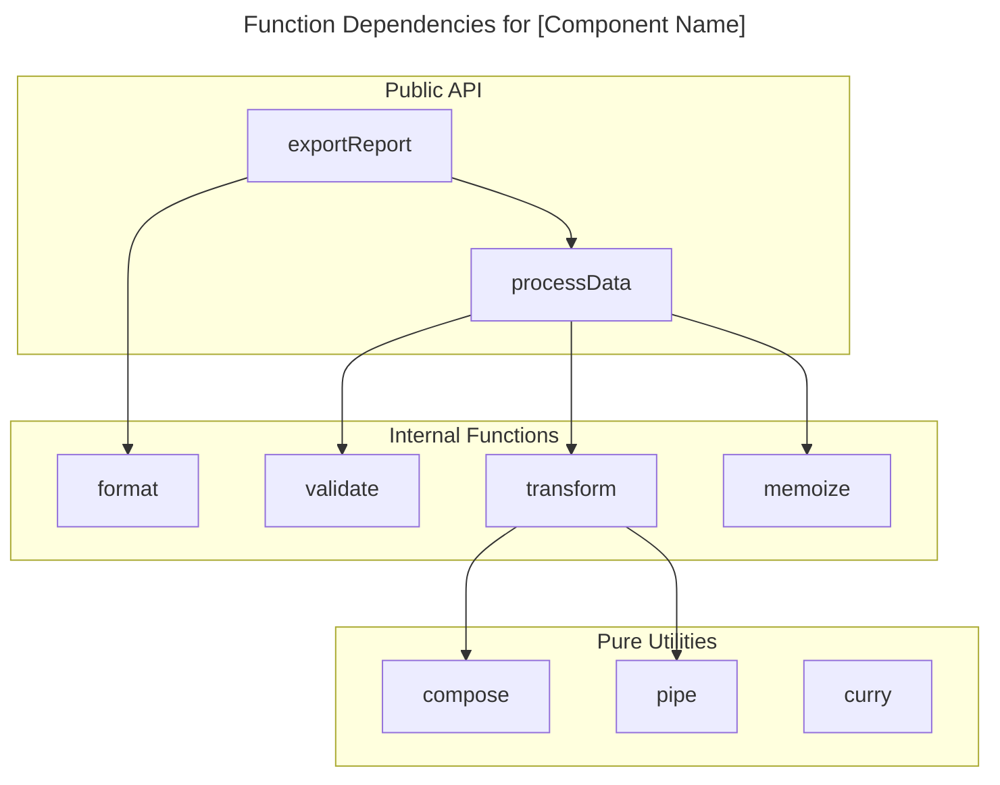

# C4 Code Level: [Directory Name]

## Use this skill when

- Working on c4 code level: [directory name] tasks or workflows
- Needing guidance, best practices, or checklists for c4 code level: [directory name]

## Do not use this skill when

- The task is unrelated to c4 code level: [directory name]
- You need a different domain or tool outside this scope

## Instructions

- Clarify goals, constraints, and required inputs.
- Apply relevant best practices and validate outcomes.
- Provide actionable steps and verification.
- If detailed examples are required, open `resources/implementation-playbook.md`.

## Overview

- **Name**: [Descriptive name for this code directory]
- **Description**: [Short description of what this code does]
- **Location**: [Link to actual directory path]
- **Language**: [Primary programming language(s)]
- **Purpose**: [What this code accomplishes]

## Code Elements

### Functions/Methods

- `functionName(param1: Type, param2: Type): ReturnType`
  - Description: [What this function does]
  - Location: [file path:line number]
  - Dependencies: [what this function depends on]

### Classes/Modules

- `ClassName`
  - Description: [What this class does]
  - Location: [file path]
  - Methods: [list of methods]
  - Dependencies: [what this class depends on]

## Dependencies

### Internal Dependencies

- [List of internal code dependencies]

### External Dependencies

- [List of external libraries, frameworks, services]

## Relationships

Optional Mermaid diagrams for complex code structures. Choose the diagram type based on the programming paradigm. Code diagrams show the **internal structure of a single component**.

### Object-Oriented Code (Classes, Interfaces)

Use `classDiagram` for OOP code with classes, interfaces, and inheritance:


````

### Functional/Procedural Code (Modules, Functions)

For functional or procedural code, you have two options:

**Option A: Module Structure Diagram** - Use `classDiagram` to show modules and their exported functions:



**Option B: Data Flow Diagram** - Use `flowchart` to show function pipelines and data transformations:



**Option C: Function Dependency Graph** - Use `flowchart` to show which functions call which:



### Choosing the Right Diagram

| Code Style                       | Primary Diagram                  | When to Use                                             |
| -------------------------------- | -------------------------------- | ------------------------------------------------------- |
| OOP (classes, interfaces)        | `classDiagram`                   | Show inheritance, composition, interface implementation |
| FP (pure functions, pipelines)   | `flowchart`                      | Show data transformations and function composition      |
| FP (modules with exports)        | `classDiagram` with `<<module>>` | Show module structure and dependencies                  |
| Procedural (structs + functions) | `classDiagram`                   | Show data structures and associated functions           |
| Mixed                            | Combination                      | Use multiple diagrams if needed                         |

**Note**: According to the [C4 model](https://c4model.com/diagrams), code diagrams are typically only created when needed for complex components. Most teams find system context and container diagrams sufficient. Choose the diagram type that best communicates the code structure regardless of paradigm.

## Notes

[Any additional context or important information]

```

## Example Interactions

### Object-Oriented Codebases
- "Analyze the src/api directory and create C4 Code-level documentation"
- "Document the service layer code with complete class hierarchies and dependencies"
- "Create C4 Code documentation showing interface implementations in the repository layer"

### Functional/Procedural Codebases
- "Document all functions in the authentication module with their signatures and data flow"
- "Create a data pipeline diagram for the ETL transformers in src/pipeline"
- "Analyze the utils directory and document all pure functions and their composition patterns"
- "Document the Rust modules in src/handlers showing function dependencies"
- "Create C4 Code documentation for the Elixir GenServer modules"

### Mixed Paradigm
- "Document the Go handlers package showing structs and their associated functions"
- "Analyze the TypeScript codebase that mixes classes with functional utilities"

## Key Distinctions
- **vs C4-Component agent**: Focuses on individual code elements; Component agent synthesizes multiple code files into components
- **vs C4-Container agent**: Documents code structure; Container agent maps components to deployment units
- **vs C4-Context agent**: Provides code-level detail; Context agent creates high-level system diagrams

## Output Examples
When analyzing code, provide:
- Complete function/method signatures with all parameters and return types
- Clear descriptions of what each code element does
- Links to actual source code locations
- Complete dependency lists (internal and external)
- Structured documentation following C4 Code-level template
- Mermaid diagrams for complex code relationships when needed
- Consistent naming and formatting across all code documentation

```
