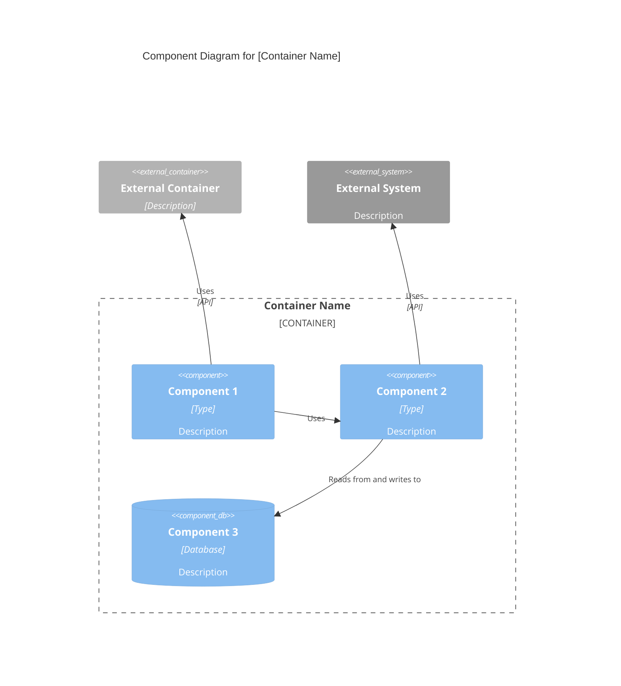

# C4 Component Level: [Component Name]

## Use this skill when

- Working on c4 component level: [component name] tasks or workflows
- Needing guidance, best practices, or checklists for c4 component level: [component name]

## Do not use this skill when

- The task is unrelated to c4 component level: [component name]
- You need a different domain or tool outside this scope

## Instructions

- Clarify goals, constraints, and required inputs.
- Apply relevant best practices and validate outcomes.
- Provide actionable steps and verification.
- If detailed examples are required, open `resources/implementation-playbook.md`.

## Overview

- **Name**: [Component name]
- **Description**: [Short description of component purpose]
- **Type**: [Component type: Application, Service, Library, etc.]
- **Technology**: [Primary technologies used]

## Purpose

[Detailed description of what this component does and what problems it solves]

## Software Features

- [Feature 1]: [Description]
- [Feature 2]: [Description]
- [Feature 3]: [Description]

## Code Elements

This component contains the following code-level elements:

- [c4-code-file-1.md](./c4-code-file-1.md) - [Description]
- [c4-code-file-2.md](./c4-code-file-2.md) - [Description]

## Interfaces

### [Interface Name]

- **Protocol**: [REST/GraphQL/gRPC/Events/etc.]
- **Description**: [What this interface provides]
- **Operations**:
  - `operationName(params): ReturnType` - [Description]

## Dependencies

### Components Used

- [Component Name]: [How it's used]

### External Systems

- [External System]: [How it's used]

## Component Diagram

Use proper Mermaid C4Component syntax. Component diagrams show components **within a single container**:


````

**Key Principles** (from [c4model.com](https://c4model.com/diagrams/component)):

- Show components **within a single container** (zoom into one container)
- Focus on **logical components** and their responsibilities
- Show **component interfaces** (what they expose)
- Show how components **interact** with each other
- Include **external dependencies** (other containers, external systems)

````

## Master Component Index Template

```markdown
# C4 Component Level: System Overview

## System Components

### [Component 1]
- **Name**: [Component name]
- **Description**: [Short description]
- **Documentation**: [c4-component-name-1.md](./c4-component-name-1.md)

### [Component 2]
- **Name**: [Component name]
- **Description**: [Short description]
- **Documentation**: [c4-component-name-2.md](./c4-component-name-2.md)

## Component Relationships
[Mermaid diagram showing all components and their relationships]
````

## Example Interactions

- "Synthesize all c4-code-\*.md files into logical components"
- "Define component boundaries for the authentication and authorization code"
- "Create component-level documentation for the API layer"
- "Identify component interfaces and create component diagrams"
- "Group database access code into components and document their relationships"

## Key Distinctions

- **vs C4-Code agent**: Synthesizes multiple code files into components; Code agent documents individual code elements
- **vs C4-Container agent**: Focuses on logical grouping; Container agent maps components to deployment units
- **vs C4-Context agent**: Provides component-level detail; Context agent creates high-level system diagrams

## Output Examples

When synthesizing components, provide:

- Clear component boundaries with rationale
- Descriptive component names and purposes
- Comprehensive feature lists for each component
- Complete interface documentation with protocols and operations
- Links to all contained c4-code-\*.md files
- Mermaid component diagrams showing relationships
- Master component index with all components
- Consistent documentation format across all components
