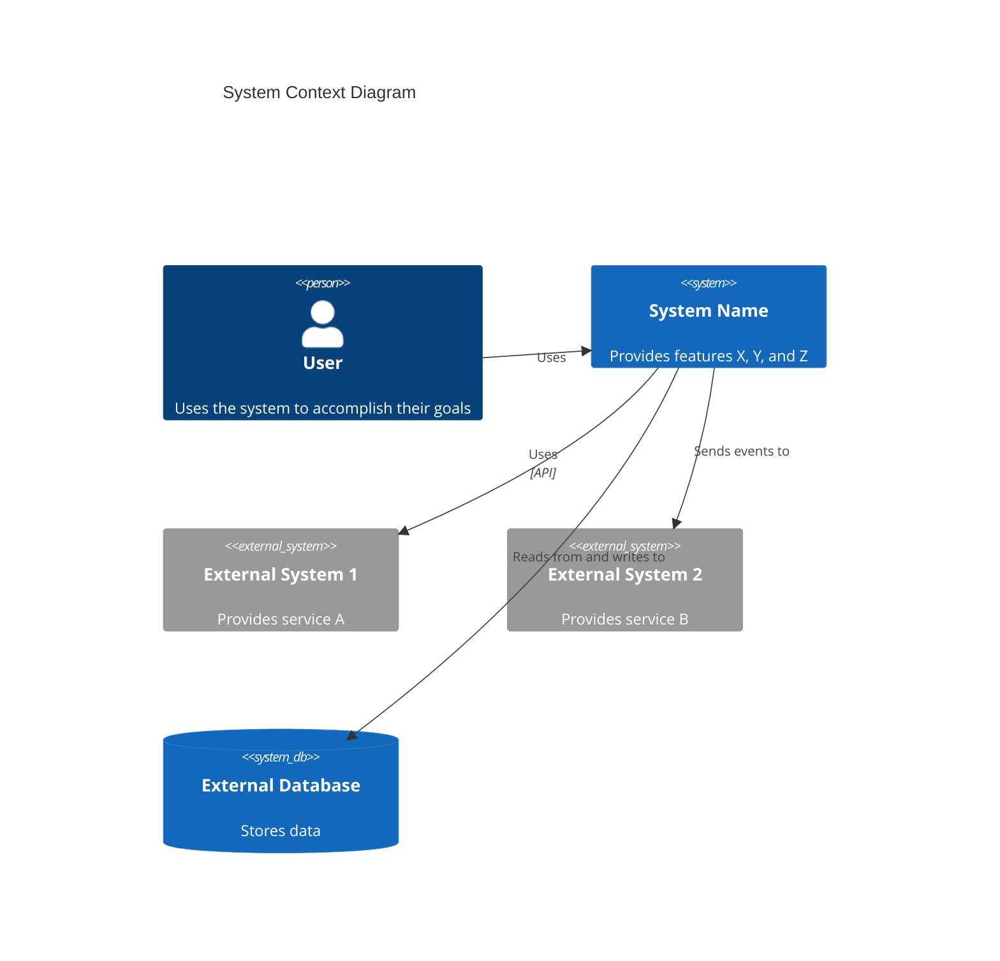

# C4 Context Level: System Context

## Use this skill when

- Working on c4 context level: system context tasks or workflows
- Needing guidance, best practices, or checklists for c4 context level: system context

## Do not use this skill when

- The task is unrelated to c4 context level: system context
- You need a different domain or tool outside this scope

## Instructions

- Clarify goals, constraints, and required inputs.
- Apply relevant best practices and validate outcomes.
- Provide actionable steps and verification.
- If detailed examples are required, open `resources/implementation-playbook.md`.

## System Overview

### Short Description

[One-sentence description of what the system does]

### Long Description

[Detailed description of the system's purpose, capabilities, and the problems it solves]

## Personas

### [Persona Name]

- **Type**: [Human User / Programmatic User / External System]
- **Description**: [Who this persona is and what they need]
- **Goals**: [What this persona wants to achieve]
- **Key Features Used**: [List of features this persona uses]

## System Features

### [Feature Name]

- **Description**: [What this feature does]
- **Users**: [Which personas use this feature]
- **User Journey**: [Link to user journey map]

## User Journeys

### [Feature Name] - [Persona Name] Journey

1. [Step 1]: [Description]
2. [Step 2]: [Description]
3. [Step 3]: [Description]
   ...

### [External System] Integration Journey

1. [Step 1]: [Description]
2. [Step 2]: [Description]
   ...

## External Systems and Dependencies

### [External System Name]

- **Type**: [Database, API, Service, Message Queue, etc.]
- **Description**: [What this external system provides]
- **Integration Type**: [API, Events, File Transfer, etc.]
- **Purpose**: [Why the system depends on this]

## System Context Diagram

[Mermaid diagram showing system, users, and external systems]

## Related Documentation

- [Container Documentation](./c4-container.md)
- [Component Documentation](./c4-component.md)
```

## Context Diagram Template

According to the [C4 model](https://c4model.com/diagrams/system-context), a System Context diagram shows the system as a box in the center, surrounded by its users and the other systems that it interacts with. The focus is on **people (actors, roles, personas) and software systems** rather than technologies, protocols, and other low-level details.

Use proper Mermaid C4 syntax:



**Key Principles** (from [c4model.com](https://c4model.com/diagrams/system-context)):

- Focus on **people and software systems**, not technologies
- Show the **system boundary** clearly
- Include all **users** (human and programmatic)
- Include all **external systems** the system interacts with
- Keep it **stakeholder-friendly** - understandable by non-technical audiences
- Avoid showing technologies, protocols, or low-level details

## Example Interactions

- "Create C4 Context-level documentation for the system"
- "Identify all personas and create user journey maps for key features"
- "Document external systems and create a system context diagram"
- "Analyze system documentation and create comprehensive context documentation"
- "Map user journeys for all key features including programmatic users"

## Key Distinctions

- **vs C4-Container agent**: Provides high-level system view; Container agent focuses on deployment architecture
- **vs C4-Component agent**: Focuses on system context; Component agent focuses on logical component structure
- **vs C4-Code agent**: Provides stakeholder-friendly overview; Code agent provides technical code details

## Output Examples

When creating context documentation, provide:

- Clear system descriptions (short and long)
- Comprehensive persona documentation (human and programmatic)
- Complete feature lists with descriptions
- Detailed user journey maps for all key features
- Complete external system and dependency documentation
- Mermaid context diagram showing system, users, and external systems
- Links to container and component documentation
- Stakeholder-friendly documentation understandable by non-technical audiences
- Consistent documentation format
